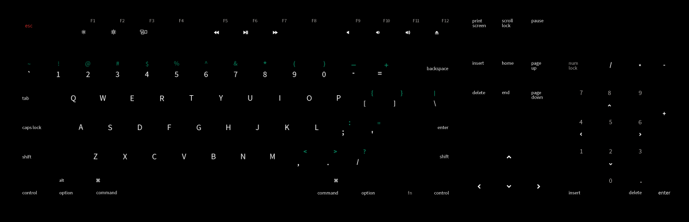
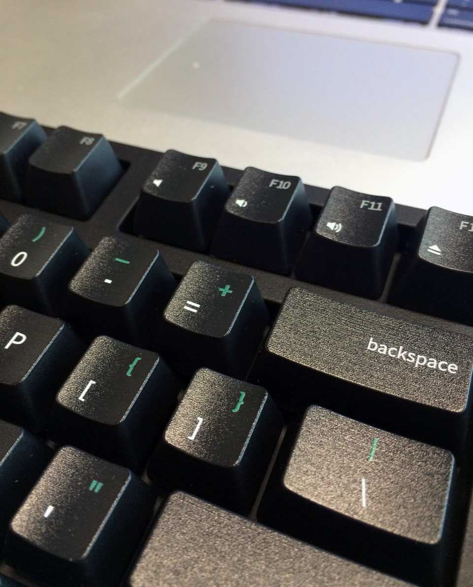

# WASD Keyboard Design

This is a 104 key [WASD keyboard](http://wasdkeyboards.com/) design specifically made for coders on macs.

It features ...

- Coder friendly offset key designs to make it easier to match sqaure and curly brackets
- Colour coded shift function keys
- Close as possible emulation to the standard mac keyboard layouts

## Art Files

I have provided the original art files in Adobe Illustrator format. Make sure that you convert all your fonts to outlines before sendin to WASD for processing.

You will also need the [Adobe Source Code Pro](https://github.com/adobe-fonts/source-code-pro) font available at https://github.com/adobe-fonts/source-code-pro

## Dip switch settings

1: on, 2: off, 3: off, 4: off, 5: off, 6: off

## Key Mappings

Use [karabiner](https://pqrs.org/osx/karabiner/) to remap key functions so that your keyboard behaves like it should.

I have provided my private.xml file to get you started.

